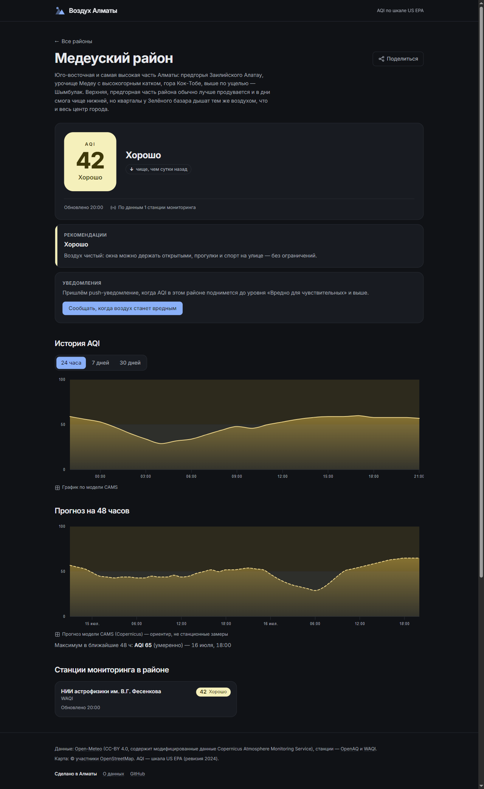
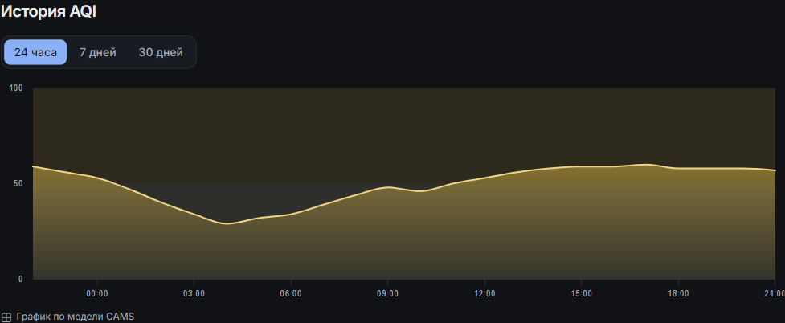
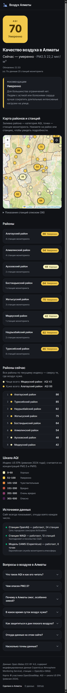
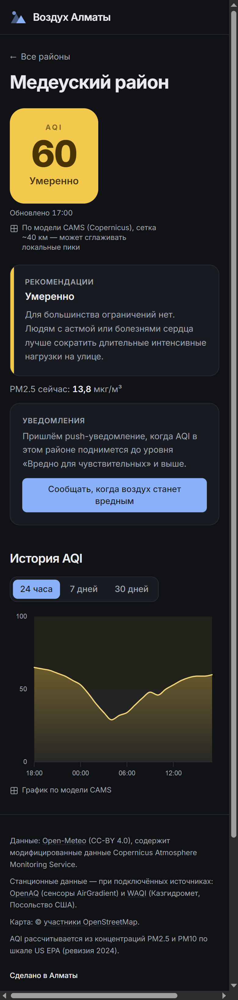

# Воздух Алматы

**https://almaty-air-two.vercel.app**

**Качество воздуха в Алматы в реальном времени.** Карта районов с текущим AQI, графики за 24 часа / 7 дней / 30 дней, понятная шкала «что это значит» и практические рекомендации.

Смог — реальная проблема Алматы, особенно в сезон зимних инверсий. Этот сервис показывает честные данные: что известно по станциям мониторинга, что — по модели, и никогда не выдаёт одно за другое.


Полный видео-тур по продукту: [docs/video/tour.mp4](docs/video/tour.mp4) · Скриншот главной: [home-desktop.png](docs/screenshots/home-desktop.png)

## Возможности

- **Карта районов** — 8 районов города на полигонах OSM, текущий AQI и цвет категории по каждому (Leaflet)
- **Страницы районов** — графики AQI за 24 часа / 7 дней / 30 дней (visx) с зонами категорий и рекомендациями
- **Собственная история в Postgres** — GitHub Actions раз в час дёргает `POST /api/collect`, срез по всем районам сохраняется в Supabase Postgres (Prisma); при недостаточном покрытии окна графики честно откатываются на модель CAMS
- **PWA** — устанавливается на телефон и десктоп; офлайн-шелл: последние открытые страницы и тайлы карты доступны без сети
- **Push-уведомления** — подписка на свой район; уведомление приходит, когда воздух пересекает границу «вредно для чувствительных» (AQI ≥ 101), с анти-спам кулдауном
- **Динамические OG-карточки** — превью ссылки с актуальным AQI для главной и каждого района

| Страница района — десктоп | График AQI крупным планом |
|:---:|:---:|
|  |  |
| <br><sub>Главная — мобильная</sub> | <br><sub>Район — мобильная</sub> |

## Данные

| Слой | Источник | Что даёт |
|---|---|---|
| Станции | [OpenAQ](https://openaq.org) (сеть сенсоров AirGradient / Almaty Air Initiative) | PM2.5 по ~124 точкам города |
| Официальные посты | [WAQI](https://aqicn.org) (Казгидромет, посольство США) | Композитный AQI станций |
| Модель | [Open-Meteo](https://open-meteo.com) (CAMS, Copernicus) | Базовый слой без ключей, история и прогноз |

Модельные данные всегда помечены как модельные (сетка CAMS ~40 км сглаживает локальные пики — об этом написано прямо в интерфейсе). AQI считается в приложении из концентраций PM2.5/PM10 по шкале US EPA (ревизия 2024 года) и покрыт юнит-тестами, включая точные границы сегментов и правила усечения.

## Стек

- **Next.js 16** (App Router, RSC, ISR), **TypeScript strict**, **Tailwind CSS v4**
- **Leaflet + OpenStreetMap** — карта районов (полигоны из OSM, ~13 КБ GeoJSON в бандле)
- **visx** — кастомные графики AQI с зонами категорий и градиентной заливкой
- **Prisma + Supabase Postgres** — почасовая история замеров и push-подписки
- **Serwist** — сервис-воркер PWA (офлайн-шелл, кэш тайлов); **web-push** — VAPID-уведомления
- **Vitest** — 259 юнит-тестов (шкала AQI, геопривязка, нормализация источников, история, push, сборщик)
- Палитра категорий AQI спроектирована с монотонной прогрессией светлоты — категории различимы при дальтонизме и в градациях серого; контраст текста ≥ 4.5:1 (WCAG AA)

## Запуск

```bash
pnpm install
pnpm dev
```

Приложение работает сразу — модельный слой Open-Meteo не требует ключей. Остальные возможности включаются переменными окружения (см. `.env.example`, значения не коммитятся):

| Переменная | Зачем | Без неё |
|---|---|---|
| `OPENAQ_API_KEY` | станционный слой OpenAQ (сенсоры AirGradient) | слой отключён |
| `WAQI_TOKEN` | официальные посты WAQI (опционально) | слой отключён |
| `DATABASE_URL` / `DIRECT_URL` | Supabase Postgres: история и push-подписки (рантайм-пулер / прямое подключение для Prisma CLI) | история падает на модель CAMS |
| `COLLECT_SECRET` | авторизация `POST /api/collect` (тот же секрет — в GitHub Actions) | почасовой сбор не работает |
| `VAPID_SUBJECT`, `NEXT_PUBLIC_VAPID_PUBLIC_KEY`, `VAPID_PRIVATE_KEY` | ключи Web Push | push отключён, приложение не падает |

```bash
pnpm test        # юнит-тесты
pnpm typecheck   # tsc --noEmit
pnpm build       # прод-сборка
```

## Архитектура

- `src/lib/aqi.ts` — шкала US EPA (брейкпоинты PM2.5 2024 года), конвертация концентрация → AQI, категории с рекомендациями
- `src/lib/districts.ts` — 8 районов города (полигоны OSM), point-in-polygon привязка станций
- `src/lib/sources/` — независимые провайдеры (OpenAQ / WAQI / Open-Meteo) с нормализацией к общему контракту, фильтром устаревших замеров и фолбэком; агрегатор никогда не бросает — статус каждого источника показывается в UI
- `prisma/schema.prisma` — таблицы почасовых срезов (`readings`, UNIQUE по району и часу) и push-подписок
- `src/lib/history.ts` — запись/чтение истории: upsert по (район, час UTC), окна 24h/7d/30d, фолбэк на CAMS при покрытии окна < 80%, ретенция 92 дня
- `src/lib/push.ts` — уведомления об ухудшении: только при пересечении AQI ≥ 101, анти-спам (6 ч кулдаун либо смена категории), протухшие подписки удаляются
- `src/app/api/collect` — точка почасового сбора (заголовок `x-collect-secret`); дёргается кроном GitHub Actions (`.github/workflows/collect.yml`)
- `src/app/sw.ts` — сервис-воркер Serwist: страницы NetworkFirst с офлайн-фолбэком, статика и тайлы OSM CacheFirst, API только из сети, обработчики push
- `src/app/opengraph-image.tsx` и `src/app/district/[slug]/opengraph-image.tsx` — динамические OG-карточки с текущим AQI
- Обновление данных: ISR + серверный кэш (30–60 мин), в пределах бесплатных лимитов всех источников

Решения и результаты исследования источников: [.planning/DECISIONS.md](.planning/DECISIONS.md), [.planning/RESEARCH.md](.planning/RESEARCH.md).

## Атрибуция

Данные о качестве воздуха: [Open-Meteo](https://open-meteo.com) (CC-BY 4.0), содержит модифицированные данные Copernicus Atmosphere Monitoring Service; [OpenAQ](https://openaq.org) / AirGradient; [WAQI](https://aqicn.org) / Казгидромет / U.S. Embassy Almaty. Карта: © участники [OpenStreetMap](https://www.openstreetmap.org/copyright).

---

## English

**Almaty Air** — real-time air quality dashboard for Almaty, Kazakhstan: a district map with current US EPA AQI (2024 revision), 24h/7d/30d charts, and plain-language health guidance in Russian.

Data comes from three independent layers with honest labeling: OpenAQ (AirGradient sensor network, ~124 stations), WAQI (Kazhydromet official posts + US Embassy monitor), and the Open-Meteo CAMS model as a zero-config baseline — model data is always marked as such. AQI is computed in-app from PM2.5/PM10 concentrations and covered by unit tests (exact breakpoint edges, EPA truncation rules, monotonicity).

The app is a full PWA: installable on phone and desktop with an offline shell (Serwist service worker), it keeps its own hourly air-quality history in Supabase Postgres (a GitHub Actions cron POSTs `/api/collect`, snapshotting every district and falling back to the CAMS model when DB coverage of a chart window is insufficient), sends Web Push notifications when a subscribed district's AQI crosses into unhealthy territory (≥ 101, with anti-spam cooldown), and serves dynamic OG images with the current AQI for every page.

Stack: Next.js 16 (App Router, RSC, ISR), TypeScript strict, Tailwind v4, Leaflet + OSM, visx charts, Prisma + Supabase Postgres, Serwist, web-push, Vitest (259 tests). The AQI category palette uses monotonic lightness progression (colorblind-safe, WCAG AA text contrast).

```bash
pnpm install && pnpm dev   # works out of the box — the model layer needs no API keys
```
